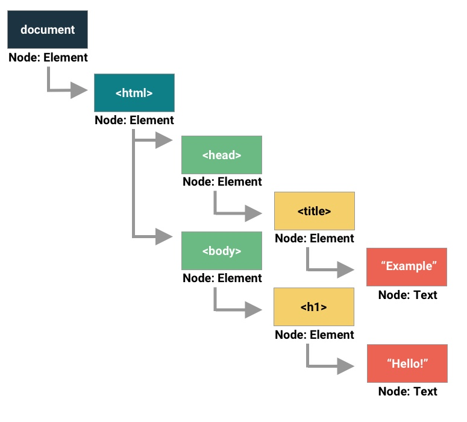

# DOM I

**DOM - Document Object Model**

**API - Application Programing Interface**

*Content ==DOM==> Browser*

* What the DOM is not
    * Javascript
    * HTML or CSS
* Static

* What the DOM is
    * Language neutral API
    * Tree like structure representing your content, structure, and style
    *  Dynamic

* Nodes and Types


* In the console

    * ```document.GetElementsByTagName('div');```  // shows all elements on a page by div
    * ```document.GetElementsByClassName('titlebar');``` // similar to above, but w/ classes
    * ```document.GetElementById('intro-info');``` // nonplural, but similar to above
    * ```document.querySelector('#intro-info');``` // any selector form our CSS can be the argument in querySelector(), but only the first item it finds that matches the argument. 
    * ```document.querySelectorAll('.nav-item');``` // can be used to return a *node list* all mating results

* Node List vs. HTML Collection Array
    * Array-like
    * '0' based index
    * has a '.length' property
    * can use ```.forEach();```
    * to use other array prototypes you can convert to a real array by: ```const arr = Array.from(nodeList)```

* Can use the selectors from above to manipulate with javascript, starting w/ setting the content of the CSS selectors to variables and using the ```.textContent``` 
    * ```const introText = document.querySelector('#intro-text');```  
    * ```introText.textContent = 'stuff and things';``` //would change the content of introText to 'stuff and things'

* Manipulating an image w/ JavaScriptthe ```.setAttributes```
    * ```cont catImg = document.querySelector('img');``` // sets catImg equal to an 
    * ```catimg.setAttribute('src', 'https://blahblahblah.com/blah)``` // changes the image to a different one, buy displaying it through the DOM (but not actually changing the  src in the HTML)
    
* Can manupulate style this way using ```.style```
    * ```const headline = document.querySelector('h1');```
    * ```headline.style.fontSize = 5rem;``` would change our ```<h1>``` to 5rem
    * ```headline.style.color = 'red';```

    *These ```.style``` uses inline styling to apply the changes which will typically tace prescidence over other styles*

* Using ```.className``` to add a class to an element
     * ```const header = document.querySelector('header');``` 
     * ```header.className = 'green';```

* Using ```.classList``` to modify the classes on an element
    * Returns a list of the classes on the element
    * can be used to modify the classes on an element
    * ```header.classList.add('large');```
    * ```header.classList.remove('large');```
    * ```header.classList.toggle('large');``` // kind of changes the state of a class on or off (true or false in the classList)

 * Using ```.createElement``` and ```.appendChild``` to add to the displayed page
    * ```const headerEl = document.querySelector('header');```
    * ```const subHeadline = document.createElement('h1');``` // creates the sub-headline
    * ```subHeadline.textContent = "Another Headline!";``` //adds content to the sub-headline
    * ```subHeadline.style.color = "white";``` //adds style to the inline style of the sub-headline
    * ```header.appendChild(subHeadline);``` //passes sub-headline into the header

* More  ```.createElement``` and ```.prependChild``` 
    * ```const section = document.querySelector('section')```
    * ``` section.style.flexWrap = 'wrap'```
    * ```section.style.justifyContent = 'center';```
    * ```const newCat = document.createElement('img');``` //creates new image
    * ```newImg.src = 'https://jhjkhjkhskfg.com/cats';``` //could use ```.setAttribute``` instead
    * ```newCat/style.marginRight = '20px';```
    * ```newCat.alt = 'Another Cat';```
    * ```section.prepend = newCat;``` // adds the newCat to the begining of the children


    


